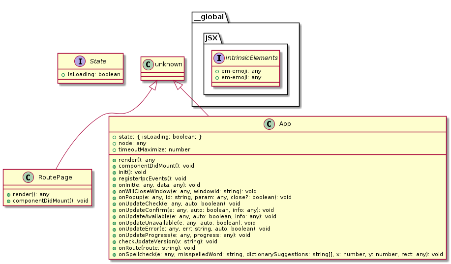

## tplant picture generaration

tplant-app.png generated with `tplant -i Anytype/src/ts/app.tsx -o ./tplant-app.png`

Initial component class diagram. (insanity) 
 genereated with `tplant -i Anytype/src/ts/component/index.ts -o ./tplant-component-index-uml.puml`